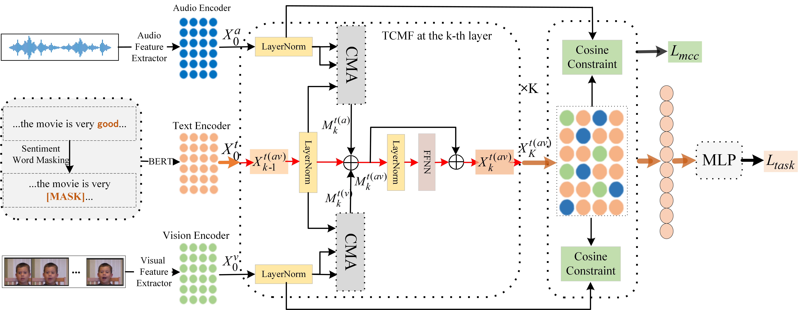

# KEBR: Knowledge Enhanced Self-Supervised Balanced Representation for Multimodal Sentiment Analysis 
Code for the MM 2024  paper



This paper proposes a knowledge-enhanced self-supervised balanced representation approach (KEBR) to capture common sentimental knowledge in unlabeled videos and explore the optimization issue of information imbalance between modalities.

## 1. Cloning this repository
```bash
$ git clone https://github.com/aoqzhu/KEBR.git
```

## 2. Creating a virtual environment, and then installing required packages
```bash
$ conda create -n envir_name python=3.8
$ source activate envir_name
$ pip install -r requirements.txt
```

## 3. Datasets
Raw pretraining datasets VoxCeleb1 and VoxCeleb2 can be acquired in [this website](https://www.robots.ox.ac.uk/~vgg/data/voxceleb) 
(You may need to apply for an account and password to get permission to download).
Raw CMU-MOSI and CMU-MOSEI datasets can be acquired in [this website](http://immortal.multicomp.cs.cmu.edu/raw_datasets).

## 4. Running the codes
### 4.1 baseline
The baseline model is not pretrained with unlabeled video data.
```bash
$ CUDA_VISIBLE_DEVICES=0 python baseline.py
```
You can change command line arguments to train different models on different datasets and backbone language models.

### 4.2 pretraining
Sentiment knowledge enhanced pretraining.
```bash
$ CUDA_VISIBLE_DEVICES=0 python pretrain.py
```

### 4.3 infering the sentiment using purely language models
```bash
$ CUDA_VISIBLE_DEVICES=0 python language_model_classifier.py
```
You can change command line arguments to train different models on different datasets and language models.

### 4.4 our models
```bash
$ CUDA_VISIBLE_DEVICES=0 python main.py
```